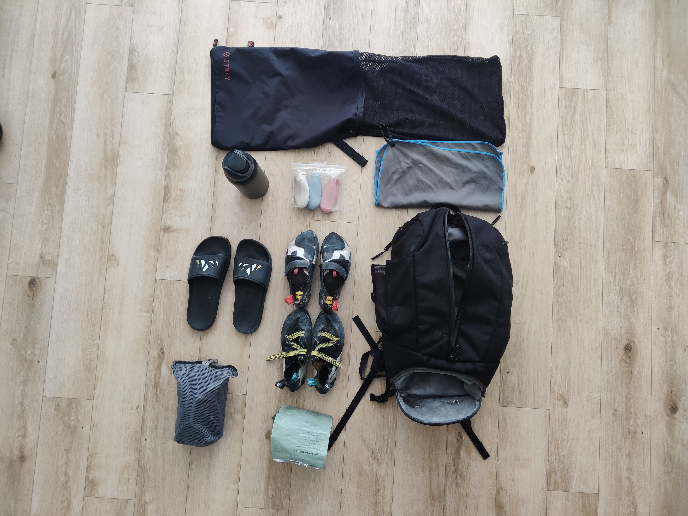
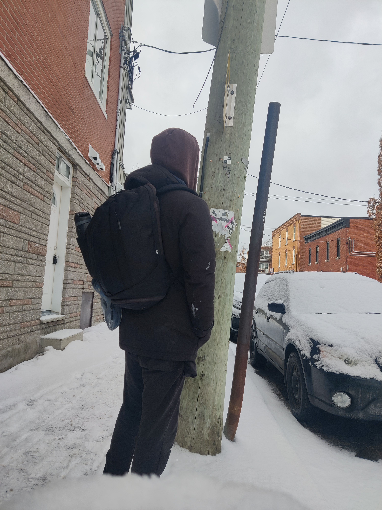

One of the problems I have wanted to solve in my day to day is the friction between getting myself to and from the gym. If you are like me, you have many things you'd like to do in a day and saving even a half hour is worth the effort. It's for situations like this where I think creating a good system can go a long way. Today, I'm going to go over the development of something I call a `Gym Kit`. It's a fancy way of saying "bag" but it sounds cool. In all seriousness though, even a bag can be transformed into a system.

## Considerations

A `Gym Kit` should be organized based on your sport of choice and your personal needs. It can also change based on how you commute or how far you commute. Sometimes you have to let go of some conveniences like an extra pair of shoes or spare towels. Getting this kit just right will help you feel more comfortable and help you move more quickly. Today, I'll go over my `4 Gym Kit Considerations` which I hope will help you refine your setup to meet your needs. As a case study, I'm going to go over my gym kit and how it has evolved overtime to streamline my gym experience as someone who boulder climbs. I know this might seem excessive but trust that the short term effort is worth the long term time savings. I'm writing an article on bags in my spare time so clearly it must be working 😉.

### Convenience

There are some elements of your kit that are going to be simply for convenience but aren't required. So what's important is you weight your needs and your wants.

#### Needs

Needs refer to the essential items you require for a successful gym trip. A prime example of a need is equipment. Each sport necessitates specific pieces of equipment; for instance, Olympic lifters may require wrist straps. Additionally, showering supplies can also be categorized as a need. For some individuals, it’s crucial to quickly leave work, head to the swimming pool, and take a shower before returning to their responsibilities.

#### Wants

Wants are items that you may desire but don't necessarily need. For a climber, this could be an extra pair of shoes. However, from a convenience standpoint, carrying an additional pair might not justify the extra space in your bag, especially if you rely on public transportation.

### Organization

When considering your packing arrangement, a key factor for most sports is finding a method to keep your dirty items separate from your clean ones. This is where having a separate bag or compartment to store your dirty gear can be incredibly helpful. The last thing you want is to get home and discover you need to air out your bag or, worse, throw the entire thing in the washing machine. Of course, if you don’t mind having a smelly bag, that’s up to you! Just remember that we might all be silently judging you 😛.

### Personalization

Depending on your personal style, you may enjoy adding a touch of customization to your gym kit to help it stand out. This is entirely optional and up to your preference. Customization can include selecting a specific brand or style for your bag, or perhaps adding trinkets and other accessories that hang from it.

### Comfort

For many, comfort plays a significant role in how they curate their gym kit. Carrying a heavy bag to and from home or the office can be uncomfortable, and if you're not cautious, it may even cause strain. It's essential to balance the level of convenience you desire with your comfort needs.

## My Setup

I wanted to outline my setup and what it consists of. Each element has a distinct purpose. Some of these items aren't required for a successful gym trip for some people, but for me, each is important and worth the weight.

### [Aer Backback](https://aersf.com/collections/all-products/products/duffel-pack-3?country=CA)

Aer is a bag company that has been around for quite some time, and I purchased one of their bags back in 2019. It has become one of my all-time favorite purchases, and its durability speaks volumes. I wanted to get something that I felt was `personalized` to my style which is typically black mat color. It combines the best features of a duffle bag and a backpack, featuring a zipper that spans the full length for easy access to a spacious compartment for my clothing. Additionally, there is a dedicated compartment at the base designed specifically for shoe storage. I typically store my shower sandals there along with my chalk bag, which helps prevent any chalk from spilling onto my other items in case of a leak. Moreover, the bag includes a compartment for my laptop, making it convenient for me to get some work done at the gym while enjoying a coffee after my climb. Overall, the bag enables me to be more `organized` and `comfortable` on my gym trips.

### [Small Soap Containers](https://www.amazon.ca/Toiletries-Opret-Containers-Accessories-Conditioner/dp/B0BX66BW16/ref=sr_1_21_sspa?sr=8-21-spons&sp_csd=d2lkZ2V0TmFtZT1zcF9tdGY)

I shower at the gym, as I have a 30-minute commute from my apartment to the bouldering gym. I appreciate the feeling of leaving the gym clean and refreshed; thus, this is more of a `convenience` and `comfort` for me. However, for some individuals with skin conditions, wearing sweaty clothing for extended periods can lead to rashes or other skin issues. In such cases, showering would be considered a necessity.

### [Carrbiner for shoes](https://www.amazon.ca/TRIWONDER-12KN-25KN-Aluminium-Carabiners/dp/B074QQTFCC/ref=sr_1_38?sr=8-38)

I have a carabiner that I use to attach my climbing shoes to the outside of my bag. Climbers typically wear their climbing shoes without socks to maximize the feel between their feet and the wall. However, this can lead to the shoes becoming quite smelly if they remain inside an enclosed bag. Therefore, I prefer to use the carabiner to keep them outside, allowing for better ventilation.

### Sandles

Sandals offer me two key benefits while I'm at the gym. First, I use them for showering, too put a bearier between my feet and the shower floor. Additionally, I wear them between climbing sessions. As climbers progress to higher difficulties, they often wear very tight shoes that can become `uncomfortable`. Therefore, I switch to my sandals during breaks, giving my poor toes the relief they need!

### Chalk bag

As a climber, bringing chalk is an obvious `need`. Though some may disagree.

### [Stinky Laundrey Bag](https://www.amazon.ca/STNKY-Health-Workers-Sports-Fitness/dp/B0881RLXNV/ref=sr_1_5?sr=8-5)

This is hands down my favorite component of my gym bag. Laundry bags provide an effective way to store your sweaty clothes after training, keeping them contained and preventing them from touching the walls of your bag or mingling with other items. This not only reduces the hassle of needing to air out your bag when you return home, but it also offers peace of mind. After a long day, I sometimes forget that I've left my laundry in the bag, so it's reassuring to know I can pull it out the next day without worrying about a foul odor lingering in my bag. I truly believe that everyone should invest in one of these for their gym trips for `convenience` sake.

### Micro-fibre Towl

When I see someone bringing a full-sized towel to the gym, it always seems so `inconvenient`. Instead, I recommend opting for a microfiber towel, which offers a comparable level of absorption to a standard towel without the excessive bulk.

### Owala Bottle

This is my favorite water bottle, and I've noticed many people using it as well. It features a metal-lined construction that provides durability and insulation. The bottle has a convenient spout, allowing you to drink through a straw or tip it for more direct sipping. If you're interested in this bottle, I recommend pairing it with a [metal straw from Koala](https://koalastraw.com/) to reduce your exposure to [microplastics](https://pmc.ncbi.nlm.nih.gov/articles/PMC10151227/).

### Two pairs of climbing shoes

As a climber, it’s essential for me to bring my climbing shoes, unless I want to rent subpar shoes for $5 each time. For added `convenience`, I often carry two pairs, each designed for different types of climbing problems.

### Harness (Don't use this much)

I occasionally bring my climbing harness, but since I primarily focus on bouldering, it frequently gets left at home.

## Conclusion

I hope this gave you some ideas for your `Gym Kit`. It's a fun thing to get just right and customize your liking.

