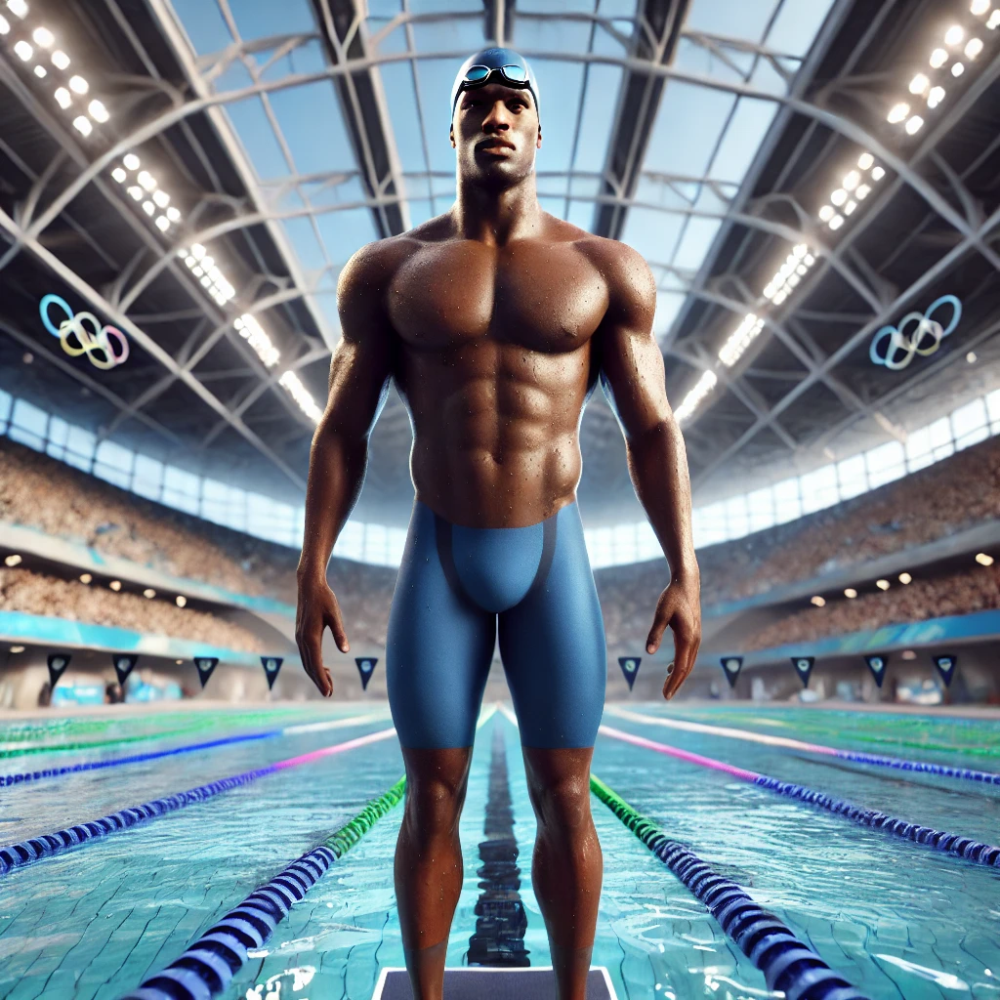

Movement is a really special part of being human. There really is nothing like it. When I mean movement I don't mean fitness. To me fitness emplies ataining a specific ideal that I don't believe is realistic or is it even desireable. Take a look at these two people (AI Generated). One is on there knee gardening and the other at an olympic event. Do you see the discrepency?

<HorizontalImages>

</HorizontalImages>

I think mose people can't see the relationship between these two images. To me there is clear relationship they are both people emersed in movement. One is a world class athelete and the other is a stay at home dad (well that's what I prompted the AI). Let's call him John. Both forms of movement are increadibly different and require different types of skills but also put different types of stress on the body and mind. The problem is that the image of fitness perpetuated online distords movement into a narrow definition that is unhealthy for the average person. Movement in my eyes should be context specific because without it, it becomes unhealthy and unsustainble.

I think people need to pay close attention to the purpose of their movement but also their priorities. The body can only take so much stress
